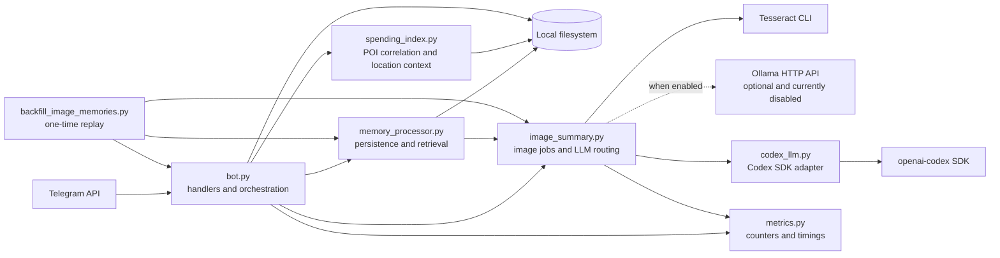
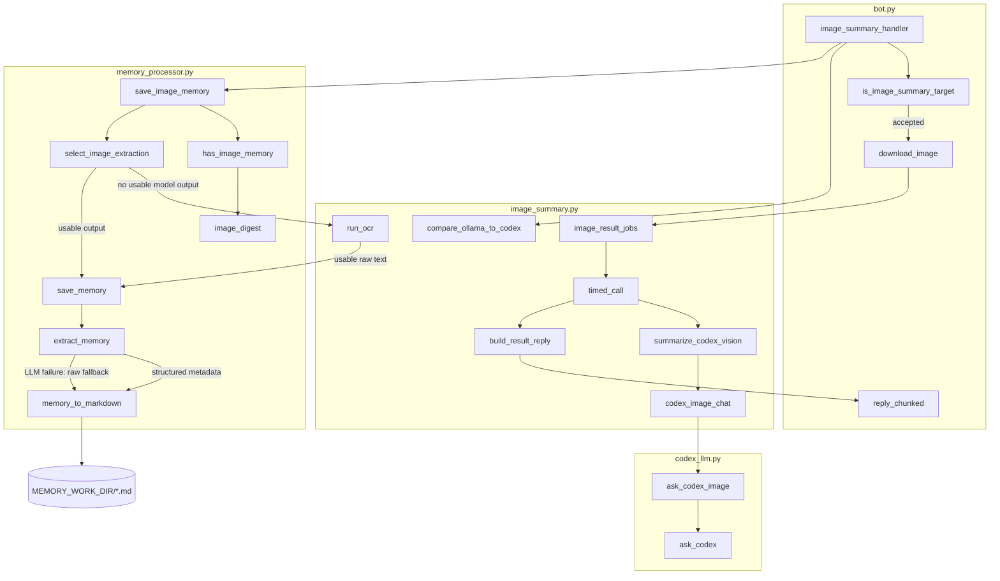
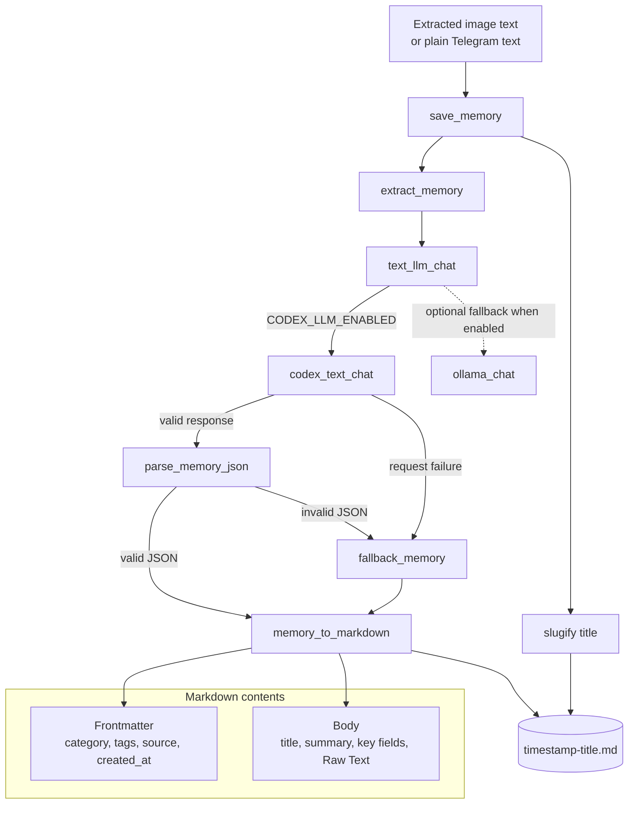
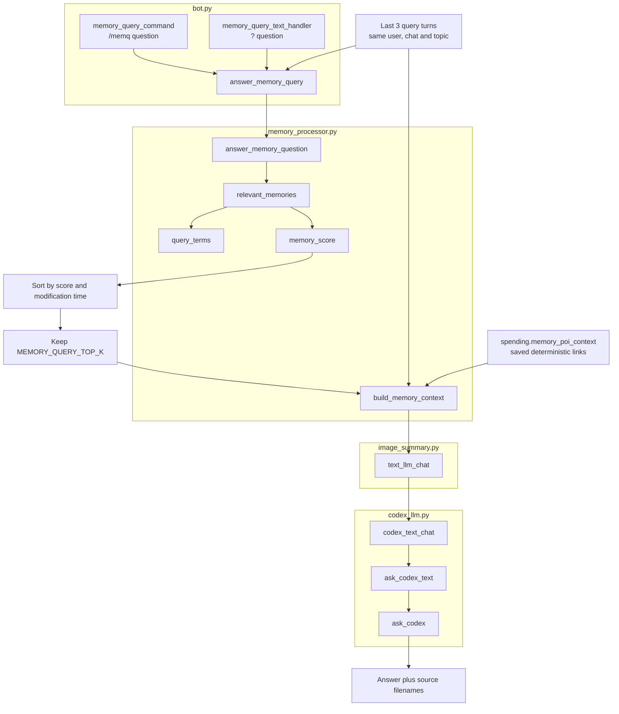
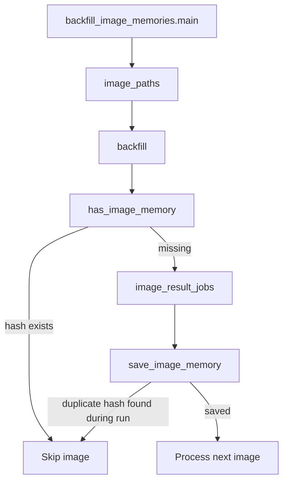

# OCR and Memory Code Flow

This document maps the source-code structure behind image ingestion, text
extraction, memory persistence, and memory queries.

Current runtime configuration:

- Codex image/text model: `gpt-5.4-mini`
- Ollama: disabled with `OLLAMA_ENABLED=false`
- Tesseract: final image-text fallback
- Memory storage: Markdown files under `MEMORY_WORK_DIR`

## Module dependencies



`memory_processor.py` imports shared configuration and LLM/OCR functions from
`image_summary.py`. `image_summary.py` does not import `memory_processor.py`, so
this dependency does not form a circular import.

## Image upload: function-level call graph



## Image upload: runtime sequence

```mermaid
sequenceDiagram
    autonumber
    actor User
    participant Telegram
    participant Bot as bot.image_summary_handler
    participant Image as image_summary
    participant Codex as codex_llm
    participant Memory as memory_processor
    participant Disk as Local filesystem

    User->>Telegram: Upload photo or image document with optional caption
    Telegram->>Bot: Update
    Bot->>Bot: is_image_summary_target
    Bot->>Telegram: Received image; processing
    Bot->>Disk: Download original image

    Bot->>Image: image_result_jobs(image_path, cfg, message.caption)
    Image->>Codex: ask_codex_image(prompt plus user comment)
    Codex-->>Image: Extracted rows, labels and facts
    Image-->>Bot: timed result dictionary
    Bot->>Telegram: Send extraction result

    Bot->>Memory: save_image_memory(image_path, results, cfg, source)
    Memory->>Disk: Calculate SHA-256 and scan existing memories

    alt image hash and same comment already stored
        Memory-->>Bot: None
        Bot->>Disk: Log image_memory_skipped
    else new image or new correction comment
        Memory->>Memory: select_image_extraction
        Memory->>Image: text_llm_chat(memory structuring prompt)
        Image->>Codex: ask_codex_text
        Codex-->>Image: JSON title, category, summary, fields and tags
        Image-->>Memory: Structured JSON text
        Memory->>Memory: memory_to_markdown
        Memory->>Disk: Write or update Markdown with full Raw Text and comment
        Memory-->>Bot: SavedMemory
        Bot->>Telegram: Saved extracted image memory
    else no usable model extraction
        Memory->>Image: run_ocr(image_path, cfg)
        Image-->>Memory: Raw Tesseract text
        Memory->>Memory: save_memory
        Memory->>Disk: Write Markdown memory
        Memory-->>Bot: SavedMemory
        Bot->>Telegram: Saved extracted image memory
    end
```

## Memory construction internals



## Query path



The query scorer searches exact lowercase alphanumeric tokens across both the
filename and complete Markdown content. It rewards occurrence count, number of
distinct query terms covered, complete multi-term coverage, and filename
matches. It does not currently use embeddings or a separate metadata index.

## Backfill path


